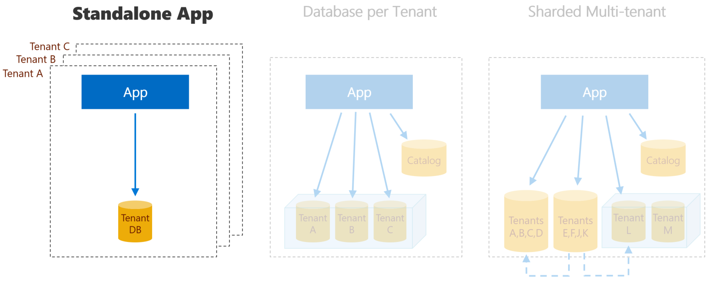

## Wingtip Tickets SaaS - Standalone Application (aka App-per-tenant)
A sample standalone single-tenant SaaS application plus management scripts, built on Azure SQL Database.



Looking for one of the other SaaS app patterns? Learn more about the [Database per tenant](https://github.com/Microsoft/WingtipTicketsSaaS-DbPerTenant) and [Sharded multi-tenant](https://github.com/Microsoft/WingtipTicketsSaaS-MultiTenantDb) versions.

### Wingtip Tickets SaaS app

The Wingtip Tickets app is a simple event listing and ticketing SaaS app, where each venue is a tenant with events, ticket prices, customers, and ticket sales. The app, together with the management scripts and tutorials, showcases an end-to-end SaaS scenario. This includes provisioning tenants, monitoring and managing performance, schema management and cross-tenant reporting and analytics, all at scale. This application is functionally identical across all three versions repositories.

### Standalone app (aka app-per-tenant) pattern

This project contains a single tenant application with a single tenant database. Each tenant’s app is deployed into a separate Azure resource group. This could be in the service provider’s subscription or the tenant’s subscription and managed by the provider on the tenant’s behalf. This pattern provides the greatest tenant isolation, but is typically the most expensive from a resource cost perspective as there is no opportunity to share resources across multiple tenants. The app uses the same patterns that might be used if the venue wrote the application for themselves. While the app is a single-tenant app and so doesn't need a catalog to resolve the location of the database, a catalog can still be provisioned and used by many management scenarios, enabling, for example, schema management of all tenant databases, cross-tenant query for reporting purposes, cross-tenant analytics, etc.      

## Get started

The application, which includes sample data for one of three venues, can be installed in your Azure subscription within a single Azure resource group. To uninstall the application, delete the resource group using the Azure Portal.

NOTE: if you install the application you will be charged for the Azure resources created.  Actual costs incurred are based on your subscription offer type but are nominal if the application is not scaled up unreasonably and is deleted promptly after you have finished exploring the tutorials.

More information about the sample app can be found in the [associated tutorials]() (available shortly).

Click any of the buttons below to deploy a venue-specific version of the app to Azure. Deploy each app in a new resource group and provide a short *user* value that will be appended to resource names to make them globally unique.  Your initials and a number is a good pattern to use.  USE THE SAME USER VALUE FOR ALL THREE APPLICATIONS if you plan to use any of the management tutorials.


<a href="https://aka.ms/deploywingtipsa-contoso" target="_blank">

</a> Contoso Concert Hall
</p>
<a href="https://aka.ms/deploywingtipsa-fabrikam" target="_blank">
    
</a> Fabrikam Jazz Club</p>
<a href="https://aka.ms/deploywingtipsa-dogwood" target="_blank">
    
</a> Dogwood Dojo </p>


After deployment completes, launch the app by browsing to the corresponding URL, substituting *USER* with the value you set during deployment: </p>```http://events.contosoconcerthall.USER.trafficmanager.net``` </p>
```http://events.fabrikamjazzclub.USER.trafficmanager.net```</p>
```http://events.dogwooddojo.USER.trafficmanager.net```  

**IMPORTANT:** If you download and extract the repo or [Learning Modules](https://github.com/Microsoft/WingtipSaaS/tree/master/Learning%20Modules) from a zip file, make sure you unblock the .zip file before extracting. Executable contents (scripts, dlls) may be blocked by Windows when zip files are downloaded from an external source.

To avoid scripts from being blocked by Windows:

1. Right click the zip file and select **Properties**.
1. On the **General** tab, select **Unblock** and select **OK**.


## License
Microsoft Wingtip SaaS sample application and tutorials are licensed under the MIT license. See the [LICENSE](https://github.com/Microsoft/WingtipSaaS/blob/master/license) file for more details.

# Contributing

This project has adopted the [Microsoft Open Source Code of Conduct](https://opensource.microsoft.com/codeofconduct/). For more information see the [Code of Conduct FAQ](https://opensource.microsoft.com/codeofconduct/faq/) or contact [opencode@microsoft.com](mailto:opencode@microsoft.com) with any additional questions or comments.
